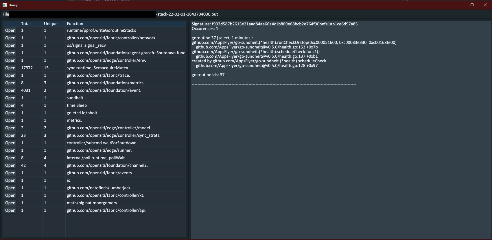

# grid - Go Routine Inspect Dumps


GRID provides both a go module to parse dump files (`grid/dump`) and an executable GUI (`grid`) to show the results of the parse (`cmd/grid`). 
The goals is to aid with human interpretation of golang go routine dumps. In large programs with many go routines (due to workers, threads, etc.)
it can be difficult to see which go routiens are the same (stack wise) and which ones are unique.

GRID's parser provides both the raw parse and "de-duped" go routines. Go routines have a signature that is calculated by the go routine's stack
trace at the source file line level. The entire go routiens signature is then matched against all other go routines in the dump to group them
together.



## The Parser: Dump

The dump module can take in a go routine dump file and produces a `Dump` struct. It can be included in your golang project with your 
own UI or CLI output. It is developed completely separate from the UI `grid`. It can be invoked by the `dump.ParseFile()` function which has the 
following signature:

```
ParseFile(filePath string, logger Logger) (*Dump, error)
```

With an example invocation of:

```
    dump, err := dump.ParseFile(pathToDumpFile, logrus.New())
```

The first argument, `filePath`, is simply the path to the go routine dump file. The second argument, `logger`, is
any logger you wish that satisfies the interface requirements (e.g. logrus).

The result of a parse is either error or a `Dump` struct.

```
type Dump struct {
	Routines []*Routine
	Stats    *Stats
}
```

`Dump` structs has the raw parsed `Routine`s as well as a `Stats` struct that contain structs that have been organized
by function and type as well as having duplicate stacks reduced to 1 entry. All the raw routines still are available
inside the `Stats` struct if needed.


## The GUI: GRID

The GRID UI is an immediate mode UI. It can be invoked by downloading a release or building this project and running:

```
> grid gui <path.to.dump>
```


## Upcomming Features

1) Dump searching
2) Opening 0..n dump files
3) Dump export
4) UX improvements

## Building This Project

This project uses [AllenDang's GIU](https://github.com/AllenDang/giu) library and is subject to that project's build
requirements. See your OS's requirements [here](https://github.com/AllenDang/giu#install).

Once complete, building GRID can be accomplished as follows:

1) Check out the repository
2) Navigate to checkout repository
3) Install via `go`
```
go install ./...
```

If you wish to make the binary portale, ensure you include ldflags/extldflags to create a statically linked binary. For hints, see this projects release workflow.
